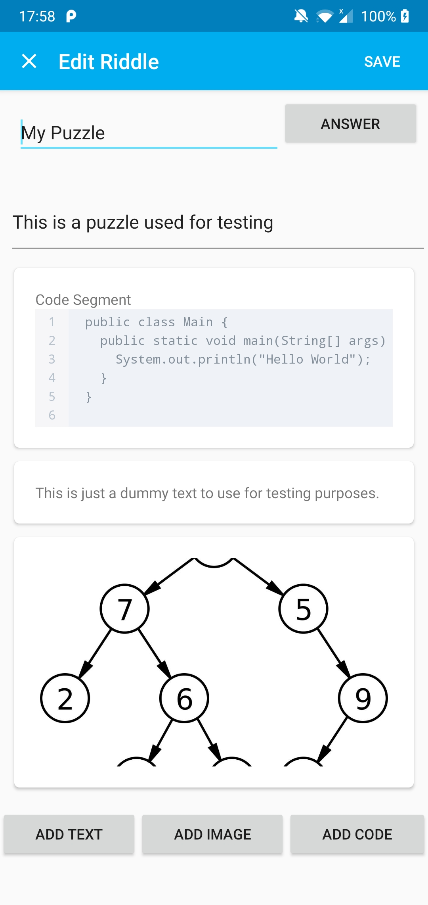
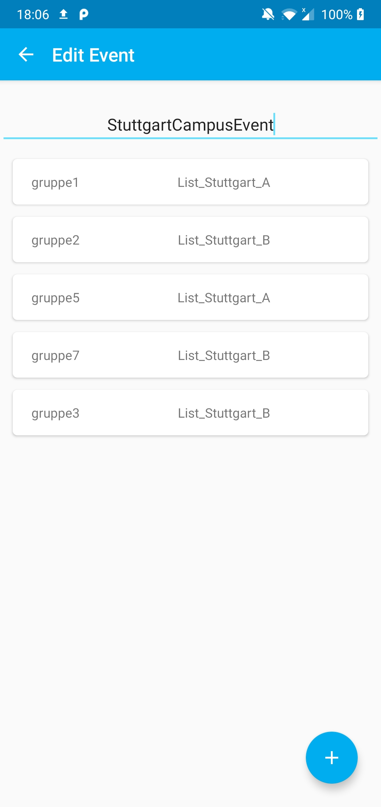

# Itestra Geocoding mobile App

Die App kann verwendet werden, um eine Art digitale "Schnitzeljagd" zu veranstalten. Dabei können den Teilnehmern verschiedete Rätsellisten zugeteilt werden.
 Diese Rätsellisten enthalten verschiedene Aufgaben, die die Teilnehmer lösen müssen, um im Spiel voranzuschreiten.
 Durch diese App soll das bis jetzt auf Papier durchgeführte GeoCoding digitalisiert werden.

 Spaß am Spiel und kollektive Gruppenarbeit stehen dabei natürlich immer in Vordergrund.

## Features

### Spielverwaltung
Es ist möglich für einen Spielleiter ein Event nach belieben zu konfigurieren. Dabei können Rätsel erstellt und zu Rätsellisten hinzugefügt werden,
sowie Gruppen und veschiedene Events verwaltet werden.
#### Komponentenweise Rätsel-Erstellung
Rätsel können aus beliebig vielen Bildern, Texten und Codesegmenten zusammengesetzt werden.
Das Gleiche gilt auch für die Antwortmöglichkeiten. Diese können aus einer beliebigen Zusammenstellungen von GPS-Koordinaten, QR-Codes und Texten bestehen.
#### Rätsellisten
Verschiedene Rätsel werden in Rätsellisten zusammengefasst. Innerhalb eines Events werden dann diese Listen beliebigen Gruppen zugeordnet.
#### Mehrere Events
Die App ermöglicht es mehrere Events zu erstellen, wobei jedes Event eine eigene Zusammenstellung von Gruppen und Rätsellisten entspricht.
Verschiedene Events können auch parallel zueinander ausgeführt werden.
### Spieldurchführung
Ein Teilnehmer kann an einem vom Spielleiter erstellten und gestartetem Event teilnehmen und die entsprechenden Rätsel lösen.
Währenddessen hat der Spielleiter die Möglichkeit den Fortschritt zu beobachten und zu das Event steuern.
### Import und Export
Der Spielleiter kann bestehende Events importieren, sowie ein erstelltes Event exportieren, um dieses an Teilnehmer zu verschicken. Die Teilnehmer können das Event importieren und ausführen.
### Code Formatierung
Der Spielleiter kann beim Erstellen von Codesegmenten eines Rätsels den Java Code automatisch formatieren lassen.
### Verschlüsselung
Passwörter sowie exportierte Events sind verschlüsselt.

## Installation

1. Repository klonen: `git clone`
2. Android Studio Projekt öffnen
3. Android Studio Projekt bauen
4. Android Studio Projekt im Emulator ausführen oder APK erstellen lassen

Initialer Login als Admin: Username: **admin** Passwort: **pass**

Beispielnutzer: **Gruppe1** Passwort: **d7h8ic**

## Verwendung der App

### Recuitung Veranstalltungen z.B. auf Messen, Tag der offenen Tür, etc.
### Firmeninternes Events z.B Team-Bonding

## Verwendete Bibliotheken

Room Persistence Libary https://developer.android.com/topic/libraries/architecture/room.

Jackson https://github.com/FasterXML/jackson

Google Java Format https://github.com/google/google-java-format

CodeView-Android https://github.com/kbiakov/CodeView-Android

ZXing Android Embedded https://github.com/journeyapps/zxing-android-embedded 

## Galerie

## Lizenz

Dieses Projekt ist unter der MIT Lizenz lizensiert. Genaue Bedingungen der Lizenz können in [LICENSE](LICENSE) nachgelesen werden.